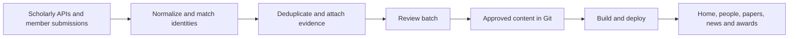

# Behavioral Data Science website: inventory and maintenance spec

**Historical audit/research:** See [NEXT_STEPS.md](NEXT_STEPS.md) for the current React implementation roadmap and issue tracker. Earlier Jekyll/Astro recommendations and delivery phases below are superseded.

**Selected stack:** React + Next.js, plain CSS, JSON/Markdown content, Python maintenance helpers, and GitHub Pages. The React migration is implemented locally; automated weekly discovery and production deployment remain pending. Earlier framework comparisons below are historical research.
Draft for discussion, September 4, 2026. This document proposes a system; it does not enable jobs, publish content, or establish a verified current lab roster.

## Recommendation

Keep a static website backed by structured content in Git. Add a service that discovers publication candidates, checks identities and duplicates, and prepares a weekly review batch. Members can submit a DOI, paper URL, award announcement, or profile correction through a short form. An editor approves changes once, and the site generates all affected pages from the same records.

Confirmed user decision: prepare a weekly batch for review before publishing. Automatic publication is a possible later option requiring a separate decision and an explicit, tested matching policy. Continue reviewing awards, affiliation changes, editorial summaries, and ambiguous matches. Automating collection is practical; assuming every external author match or award mention is correct is not.

The current Jekyll site can support the first version. A visual redesign can follow independently; a framework migration is not required to solve stale content.

Follow-up tooling research now recommends **Astro + TypeScript + Pagefind** for a full rebuild, with the same separate ingestion and weekly review pipeline. Keeping Jekyll remains the smaller modernization option. See [Modern stack options](MODERN_STACK_OPTIONS.md) for the comparison, feature mapping and service requirements; this is a proposal, not an implemented migration.

**Latest user constraint:** Prefer a simple, familiar stack that future lab members can maintain. Astro is not selected. Evaluate modernizing Jekyll and managed WordPress alongside mainstream React/Next.js, distinguishing the work of editing content from maintaining code. Weekly human review remains the confirmed publishing policy.

## Audit scope and baseline

Inspected the local source, committed source at `d6a7b92de79642aee11c2c5bfe60c94588beae79`, and public home, team, and publication pages. The earlier GitHub check found that commit at remote `master`, dated December 1, 2025, with a successful Pages deployment. No tracked custom `.github` workflows were present in that commit.

There are significant unpublished local changes. They consolidate navigation into homepage sections, remove the separate team/publication page source files, adjust roster visibility, and reorganize maintenance scripts. They must be reconciled deliberately before implementing the redesign. The local CODEBASE.md still references some deleted pages, so it is not a definitive inventory.

| Content measure | Committed source | Local working copy |
| --- | --- | --- |
| Publication records | 47, spanning 2014–2024 | 47, spanning 2014–2024 |
| Publications marked as highlights | 5 | 5 |
| Publications with an award field | 3 | 3 |
| People records | 18, including 8 marked inactive | 21, including 11 marked inactive |
| Alumni list entries | 12 | 12 |
| News records | 3; latest dated June 10, 2021 | Same |
| Sponsor entries | 7 | 7 |

These are record counts, not a verified current membership count. The public team page displays nine people, alongside its alumni list. Publications from 2025 onward are absent from the collection; that establishes a gap in site content, not the complete set of missing papers. A verified bibliography backfill remains to be done.

## Existing feature inventory

| Feature | Existing behavior and evidence | Renewal requirement |
| --- | --- | --- |
| Home and lab overview | Introduction, research themes, UW/Allen School affiliation, branding, recruitment copy, people, sponsor logos. `_pages/home.md`, `_layouts/homelay.html`, shared includes. | Refresh editorial text; surface recent papers and news from shared records. |
| Navigation and responsive layout | Published navigation has Home, Team, Publications; Bootstrap mobile menu and grid. Local draft uses homepage anchors. `_includes/header.html`, `css/main.scss`. | Accessible navigation with stable URLs; homepage summaries can coexist with dedicated archive pages. |
| Team directory | Headshots, names, roles, personal websites, priority ordering, inactive filtering. `_people/`, `_includes/group.md`. | One people dataset with verified identities, role history, affiliation dates, research interests, and profile pages. |
| Visitors | Visitor fields and template logic exist. Committed visitor heading condition has a variable typo; local logic has been revised. | Support visitor dates/status without assuming the current section works as intended. |
| Alumni | Separate YAML list with optional website and role/date text. `_data/alumni.yml`. | Derive alumni from people records; retain historical lab contributions. |
| Publications | Full list ordered by year, author/venue/year text, thumbnails, PDFs. `_publications/`; committed `_pages/publications.md`, local `_includes/publications.md`. | Search/filter by person, year, topic, venue, and type; stable paper pages and external IDs. |
| Research highlights | Curated publication selection with descriptive text and optional code links. | Keep editorial selection; avoid requiring a thumbnail or summary for ordinary new papers. |
| Paper awards | Three records have award text displayed as badges. | Structured award records with exact award name, awarding body, year, recipients, linked paper, and evidence. |
| News | Three manual YAML entries and an archive template. The public `/allnews/` route currently shows Page Not Found. Homepage news include is commented out in committed source. The source template renders entries in file order, not sorted by date. | Visible, date-sorted updates generated from approved events; ISO dates and an archive. |
| Recruiting | Home has a postdoc document link and PhD application guidance. `/vacancies` source is placeholder text. | Reviewed opportunities with owner, expiry/review date, and application link. Do not assume existing openings are still active. |
| Research/gallery pages | `/research/` and `/pictures/` sources are placeholders rather than substantive maintained sections. | Publish only when populated; add topic/project pages as content becomes available. |
| Project release signup | `/idiofid/` source describes IdioFid-A and posts an email form to a Google Apps Script endpoint. | Preserve the URL and intended flow, or replace deliberately. Verify endpoint ownership and operation; no form was submitted in this audit. |
| Sponsor recognition | Seven logos from YAML. | Keep editable sponsor records and review dates. |
| Assets and downloads | Local PDFs, publication thumbnails, headshots, logos and other downloads. | Preserve existing linked asset URLs; allow an external paper URL and fallback image. |
| Site metadata and utilities | Titles, descriptions, canonical tag, favicon, custom 404, credits and UW footer. A legacy Universal Analytics snippet is present. | Configure canonical domain and metadata, check indexing/accessibility, decide whether analytics is wanted and validate any replacement. Presence of a snippet does not prove working analytics. |
| Contributor tools | Python person-entry and BibTeX-to-publication helpers; paper helper requires a PDF and thumbnail. Manual YAML news editing. | DOI/URL intake, metadata lookup, optional assets, validation, preview, review history. |
| Hosting and deployment | Jekyll/GitHub Pages; documented branch/PR workflow; latest checked deployment succeeded. | Continue automatic deployment of approved changes, with validation and rollback. |

Not found in the inspected implementation: publication search/filter controls, automated literature discovery, person-to-paper identity links, a general honors directory, structured project/dataset catalog, editorial review inbox, content freshness monitoring, or an authenticated content editor.

Public evidence: [home](https://behavioral-data.github.io/), [team](https://behavioral-data.github.io/team/), [publications](https://behavioral-data.github.io/publications/). Built-in browser verification confirmed Home/Team/Publications navigation, a Page Not Found response at `/allnews/`, and a visible email signup at `/idiofid/`. The form was not submitted. This was a content/source audit with focused browser checks, not a comprehensive visual, accessibility or integration QA pass.

## Proposed visitor experience

**Version 1:** Home, People, Publications, News & Awards, and Join/Contact. Home shows a concise lab description, selected work, and recent approved updates. People pages collect each member's papers, projects, and honors automatically. Publication cards offer DOI/publisher, preprint/PDF, code, dataset, project page, and BibTeX links where available. Missing optional assets should never block publishing a paper.

**Later:** Curated research themes and project pages connecting people, papers, code, and datasets; photos if someone owns their upkeep; RSS for public updates. Keep the IdioFID release page and existing external links working throughout migration.

Use dedicated archive URLs even if the homepage contains all key sections. Preserve `/team/`, `/publications/`, `/allnews/`, `/idiofid/`, and existing PDF links through retained routes or tested redirects. The current local consolidation needs these redirects before deployment.

## Content model

| Record | Minimum information |
| --- | --- |
| Person | Stable internal ID, preferred name, aliases, verified ORCID/OpenAlex/Semantic Scholar IDs when available, website, role, membership intervals, active/alumni/visitor state, profile review date. |
| Publication | Internal ID, DOI/arXiv/provider IDs, title, ordered authors with internal person links when verified, venue, dates, preprint/accepted/published state, topic tags, external links, optional thumbnail and curated summary. |
| Award | Exact title, awarding organization, date/year, recipients, optional paper/project, category, source URL and supporting excerpt, approval state. |
| News event | Event type/date, headline/body, related entity IDs, source, editorial state. One event can appear on home, archive, and profile pages. |
| Project | Title, short approved summary, people, papers, code, datasets, release status and external links. |
| Opportunity | Role, application URL, owner, open/closed status, closing or review date. |
| Editorial state | Source observations, last fetched/verified time, field-level overrides, approval/rejection history, and correction/suppression rules. |

Separate imported observations from approved content and human overrides. An API refresh must not overwrite a corrected name, selected thumbnail, custom description, or rejected candidate. Keep reviewer notes, unpublished submissions, credentials, and signup addresses outside the public repository and generated site.

## How updates work

1. **Confirm the roster once.** Verify author IDs using personal/institutional pages and known papers. Track members beyond just the PI. Establish membership dates and how to treat work before joining or after leaving. Proposed default: archive lab-period work; allow explicitly linked continuing collaborations after departure.
2. **Backfill.** Start with 2025–present, then reconcile older omissions. Query every verified member, including alumni needed for lab-period coverage. Import candidates into a review queue; do not label an entire name-search result set as lab work.
3. **Discover weekly.** Use OpenAlex or Semantic Scholar author records for candidates; Crossref for publisher-deposited DOI metadata; arXiv for preprint discovery. Pick one primary provider during the pilot and add another only where measured coverage warrants it.
4. **Normalize and match.** Prefer DOI and arXiv identifiers; preserve author order and publication state. Fuzzy title/author matching raises a review candidate, not an automatic merge. Link a preprint and its published version into one work with version records when evidence supports the relationship.
5. **Prepare a review batch.** Show additions and changed fields, matched lab members, evidence, and conflicts. An editor can approve, edit, reject, or defer. A member can supply a DOI/URL or award source via a short form; the system fills the rest.
6. **Publish once.** Approved records generate every relevant page, publication list, award badge, and optional news event. Use one event per meaningful change; do not create another announcement for a spelling correction or repeated import.
7. **Check health.** Record each source's success/failure, candidate count, last successful sync, last approval, and last deploy. Keep the last good site on failure. Notify the designated owner about failures or overdue review batches; stay quiet on no-change runs.

### Publication automation policy

Initially review all additions. Potential later automatic additions require a verified author identity, an approved rule for lab relevance, an exact publication identifier, no duplicate/conflicting record, valid metadata and links, and no prior suppression. Preprints must remain visibly labeled. Name-only matches, ambiguous affiliation dates, author-profile merges, and changed titles/venues go to review.

Publication dates and membership periods are evidence, not a complete definition of lab contribution: delayed publication and work spanning institutions require an override. Never silently delete a paper because one source no longer returns it. Flag corrections, withdrawals and retractions for review rather than treating them as ordinary metadata refreshes.

### Awards, news, and people

Use conference/award organization announcements, UW/Allen School news, and member-submitted evidence as the main inputs. A member's website may suggest a candidate that needs confirmation. Do not assume a literature index has complete coverage of personal honors or best-paper awards.

AI can extract a draft award record and summarize a source, but an editor checks exact award type, recipients, year and wording. Distinguished paper, honorable mention, best paper and nomination remain distinct. Do not infer awards from citation counts or publish unsupported claims. Generate a linked news entry from an approved award so it only needs entering once.

Review roster, titles, recruiting and sponsor text each quarter. Automated detection can suggest a change; it should not decide that someone left the lab based on a stale or missing page.

## Technical and operating choices

Use the existing Jekyll content collections for the first implementation, Python for ingestion/validation, and GitHub review/build/deployment. Begin with repository-native review to avoid building an admin system prematurely; add a small authenticated editor if reviewers need it. A member submission form should collect only the fields needed to prepare an update.

Run the weekly workflow through a lab-owned scheduler or include an independent missed-run check. GitHub documents that public-repository schedules can be disabled after 60 days of inactivity, and scheduled runs can be delayed. A quiet lab website must not depend solely on an unchecked GitHub cron job. Select the scheduler and notification channel at implementation time; no monitor has been created by this spec.

Use pagination, caching, incremental retrieval with a lookback window, occasional full reconciliation, retries/backoff, provider-specific limits, and a request budget. Track source licensing before importing full text or images; prefer metadata and external links. Store API credentials as service secrets, never in the client or public content. Treat fetched HTML and AI-produced text as untrusted input to sanitize and validate.

Assign a primary maintainer and a backup, use lab-owned service accounts, and document credential renewal and rollback. Target a short weekly editorial review; measure effort during the pilot instead of promising zero maintenance. Exact service costs and access requirements depend on provider and hosting choices and must be checked when selecting them.

## Delivery phases and acceptance criteria

**Phase 1 — Reconcile and establish content.** Preserve current local work; agree on page structure and lab-work scope; verify roster/author IDs; normalize existing records; backfill missing papers and awards with sources. Produce a reviewed migration report and route/asset inventory.

**Phase 2 — Pilot maintenance on the existing site.** Implement discovery, matching, deduplication, submission intake, one review batch, validation, build/deploy, and health tracking. Run at least two weekly review cycles and evaluate missed papers, false matches and editor time.

**Phase 3 — Redesign.** Build the new visitor experience from approved records, retain redirects, and verify mobile/keyboard behavior, search, metadata and important external links. Add automatic publication only for a matching policy that passes the pilot review.

Acceptance checks:

- A reviewer-approved DOI import appears on the publication archive and each linked lab member's page, without manual page edits.
- Reprocessing identical inputs produces no content diff, duplicate news event, or duplicate review request.
- A preprint becoming published updates a linked work; different papers with similar titles remain distinguishable.
- A same-name researcher and a post-departure unrelated paper cannot auto-publish under the default policy.
- A paper with no PDF/thumbnail can publish with valid external links and a usable fallback layout.
- Manual corrections and rejected candidates survive future syncs.
- An award requires evidence and approval; all linked views display the same verified record.
- API errors, missing scheduler runs and deployment failures are visible to an owner; existing published content stays available.
- Approved test-set papers are all present; candidate false positives and unresolved matches are recorded for review. Do not claim exhaustive coverage solely because a sync succeeded.
- Existing public routes and linked PDFs remain reachable, including IdioFID; its signup integration receives a separate authorized functional test.
- A maintainer can undo a bad content change and redeploy using documented instructions.

## Decisions for discussion

1. Confirmed: review a weekly batch before publication. Future automatic publication remains undecided.
2. Include preprints alongside published work with clear labels?
3. Define lab work: membership-period work and continuing collaborations, or all work by current members?
4. Who owns weekly review and the quarterly roster check, with whom as backup?
5. Prefer GitHub review initially, or prioritize a web editor for contributors?

## References for the proposed integrations

- [OpenAlex authors](https://help.openalex.org/data/authors/): author identities, ORCID links, affiliations derived from works, and author-work lookup. Author identity still needs verification.
- [Semantic Scholar API](https://www.semanticscholar.org/product/api): author/paper metadata and API access; [tutorial](https://webflow.semanticscholar.org/product/api/tutorial) covers author queries and batching.
- [Crossref REST API](https://www.crossref.org/documentation/retrieve-metadata/rest-api/): publisher-deposited bibliographic metadata and DOI lookup.
- [arXiv API manual](https://github.com/arXiv/arxiv-docs/blob/develop/source/help/api/user-manual.md): programmatic preprint discovery.
- [GitHub schedule behavior](https://docs.github.com/en/actions/reference/workflows-and-actions/events-that-trigger-workflows#schedule) and [workflow inactivity](https://docs.github.com/en/actions/how-tos/manage-workflow-runs/disable-and-enable-workflows): scheduling limits and the 60-day inactivity rule.
